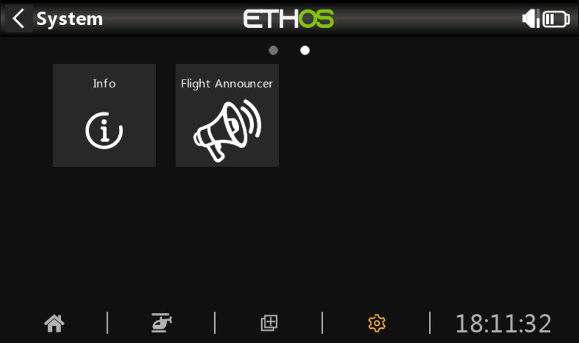
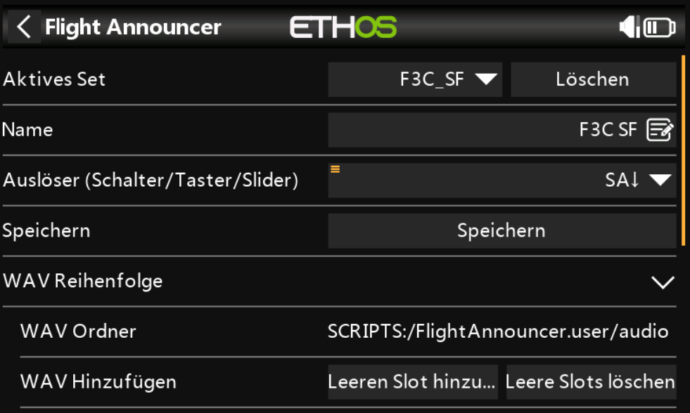
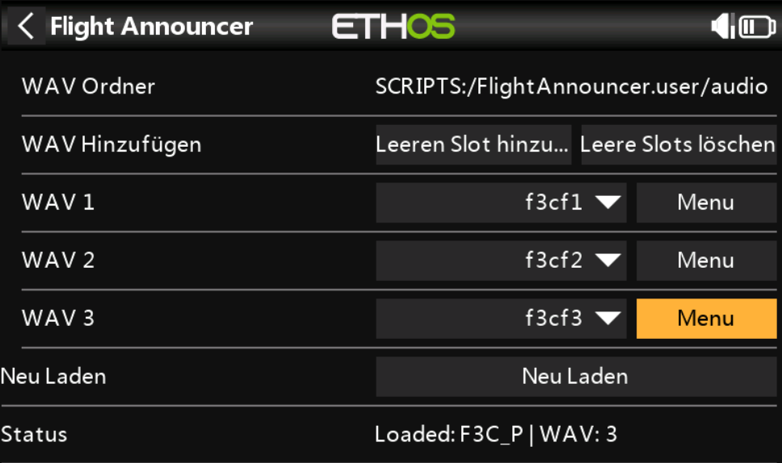
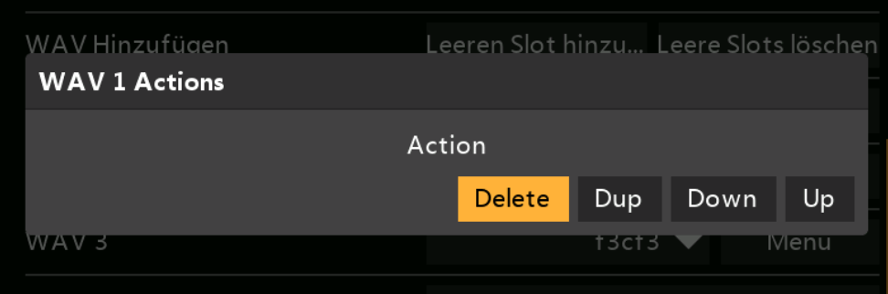

# Flight Announcer - User Documentation (English)

This guide covers installation, operation, and common workflows for the ETHOS **Flight Announcer** tool.

## Purpose

Flight Announcer plays WAV files in a defined sequence whenever your configured trigger (for example a switch) becomes active. This is useful for flight phase, maneuver, or training announcements.

## Requirements

- FrSky ETHOS (radio or simulator)
- WAV files stored in `SCRIPTS:/FlightAnnouncer.user/audio`
- Language is selected automatically from ETHOS system locale (`German`/`English`, fallback: `English`)
- Installed script folders:
  - `SCRIPTS:/FlightAnnouncer`
  - `SCRIPTS:/FlightAnnouncer.user`

## Installation on Radio

1. Copy `scripts/FlightAnnouncer` to `SCRIPTS:/FlightAnnouncer`.
2. Copy `scripts/FlightAnnouncer.user` to `SCRIPTS:/FlightAnnouncer.user`.
3. Open ETHOS: **System Tools -> Flight Announcer**.

## Quick Start

1. Start the tool.
2. Select your trigger in **Trigger (switch/button/slider)**.
3. Add rows with **Add empty slot**.
4. For each row, pick a WAV file from `SCRIPTS:/FlightAnnouncer.user/audio`.
5. Press **Save**.
6. Toggle the trigger: each new activation plays the next WAV in sequence.

## User Interface

### 1) Active Set

- Select the current profile (`*.user`)
- **Delete** removes the active set

### 2) Name and Trigger

- **Name**: display name of the set
- **Trigger**: global source shared by all sets
- UI language follows system settings automatically (no manual language switch in the tool)

### 3) WAV Sequence

- **Add empty slot**: add a new WAV row
- **Remove empty slots**: remove unassigned rows
- **Menu** per WAV row:
  - `Up`: move up
  - `Down`: move down
  - `Dup`: duplicate entry
  - `Delete`: remove entry

### 4) Save and Status

- **Save** writes profile and global trigger state
- **Reload** refreshes the set list from SD storage
- **Status** shows last message and WAV count

## Profiles and Files

Profiles are stored at:

- `SCRIPTS:/FlightAnnouncer.user/<name>.user`

Important:

- `default.user` is created automatically if no profile exists.
- Trigger state is stored globally (not in each profile file).
- Translation files are stored in `SCRIPTS:/FlightAnnouncer/i18n` (`de.lua`, `en.lua`).

## Simulator Workflow

In this VS Code workspace:

- Run task `Deploy & Launch [SIM]`

This deploys scripts to the simulator and restarts the ETHOS task chain.

## Common Issues

- Empty WAV file list:
  - Check that files exist in `SCRIPTS:/FlightAnnouncer.user/audio`.
- No playback:
  - Verify trigger source (correct switch, direction, and position).
- Changes not visible:
  - Use **Save**, then **Reload**.

## Tips

- Use short, clear WAV names (for example `phase_start.wav`).
- Keep sequence order aligned with your flight flow.
- Use separate profiles for different programs (training, competition).
